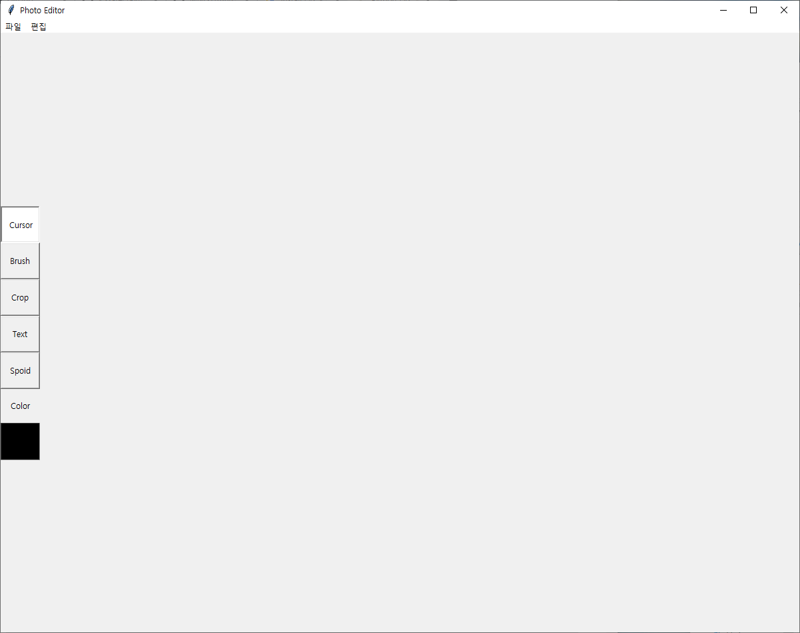

# Python_Photo_Editor

Python 3으로 제작한 GUI 이미지 편집기 프로그램입니다.

GUI는 파이썬의 기본 내장 함수인 tkinter로 구현하였습니다.

실제 이미지를 처리하는 기능은 numpy와 OpenCV로 구현하였습니다.

OpenCV로 이미지를 불러온 뒤 numpy를 통해 픽셀별로 숫자로 표현된 자료형태로 변환하고, 실제 이미지 처리는 파이썬 문법을 이용한 수식 계산을 통해 이뤄지도록 만들었습니다. 

* photo_editor_main.py는 GUI 구현 및 프로그램 실행을 위한 파일입니다.
* imgprocess.py는 이미지를 처리하는 코드를 정리한 파일입니다.
* run_editor.bat은 파일을 간편하게 실행하기 위한 파일입니다.
* 파일 실행을 위해 python3과 OpenCV, numpy가 설치되어있어야 합니다.

* 현재 구현된 기능
  * 이미지 크기 자유 변환
  * 이미지 상하반전, 좌우반전
  * 이미지 임의 각도 회전
  * 이미지 밝게
  * 이미지 어둡게
  * 이미지 흐리게
  * 이미지 선명하게
  * 이미지를 회색조로 변경
  * 이미지를 흑백으로 변경
  * 히스토그램 평활화
  * RGB 채널 조정
  * 브러쉬 기능
  * 자르기 기능
  * 텍스트 삽입 기능
  * 스포이드 기능
  * 실행 취소 기능
  * 초기화 기능

* 제약사항
  * 900x900 픽셀 이하 이미지만 편집 가능 (900x900 픽셀 이상의 이미지 열기 시 이미지 크기 자동조정)
  * 텍스트 폰트 및 크기 고정
  * 한글 텍스트 삽입 제한
  * 브러쉬 형태 및 크기 고정
  * 한글 경로 사용 제한
  * 텍스트, 브러쉬 기능 사용 시 실행 취소 기능 미작동
